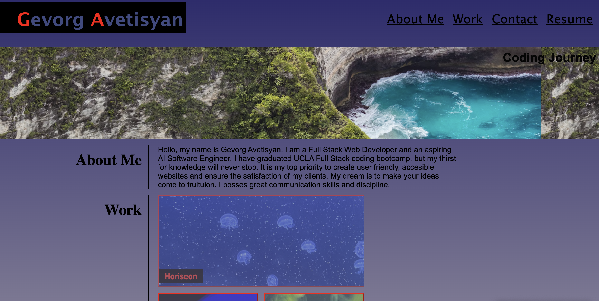

# <Gevorg Avetisyan Portfilio> 

## Portfolio

Created a portfolio for potential clients to introduce my capabalities and past projects. 

## Table of Contents

- [Refactor](#refactor)
- [Screenshot](#screenshot)
- [Horiseon Website Link](#links)

## Refactor 

1. Created an HTML code for portfolio structure. 
2. Added CSS styling and nested images inside CSS.  
3. Refactored code to a semantic HTML. 
4. Specifed CSS notes for easier understanding of code. 
5. Added contact links. 
6. Added RESPONSIVE LAYOUT.
7. Planning to update the webpage with future achieved projects. 

## Screenshot

## Link

GA Portfolio Link: (https://gevbusiness.github.io/Gevorg-Avetisyan-Portfolio/)
